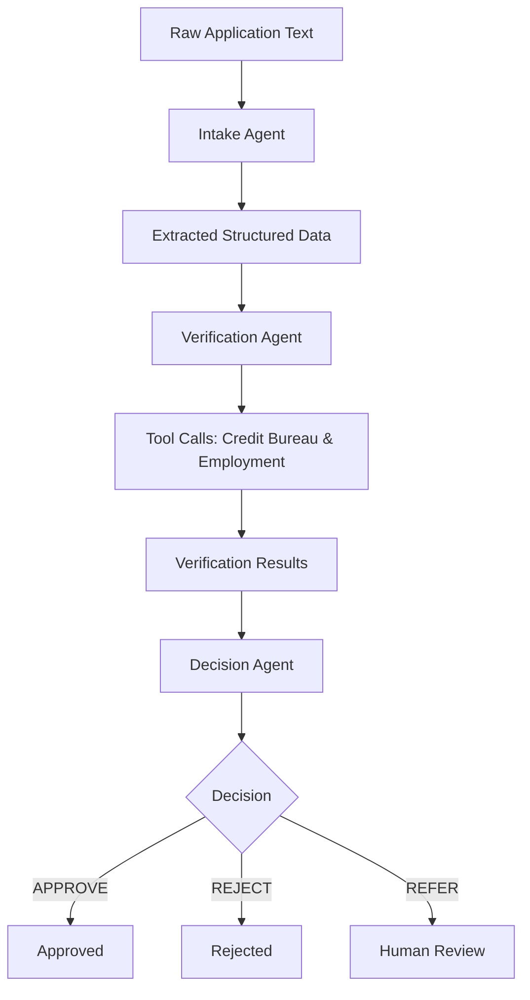

# Loan Application Triage Agent

A multi-agent AI system for automated loan application processing using LangGraph and Groq LLMs. The system intelligently triages loan applications through a structured workflow: intake → verification → decision-making, with full traceability and monitoring via Arize Phoenix.

## 🎯 Project Overview

This project demonstrates a production-ready multi-agent AI system that automates the loan application triage process. Built with modern AI engineering practices, it showcases:

- **Intelligent Document Processing**: Extracts structured data from unstructured loan applications
- **Automated Verification**: Integrates with mock credit bureaus and employment verification services
- **Risk-Based Decision Making**: Applies underwriting rules for approve/reject/refer decisions
- **Full Observability**: Complete tracing and monitoring with Arize Phoenix
- **Modular Architecture**: Clean separation of concerns with extensible agent-based design

### Key Features

- 🤖 **Multi-Agent Architecture**: Three specialized agents handle different aspects of loan processing
- 🔍 **Automated Verification**: Real-time credit and employment verification using external APIs
- 📊 **Risk Assessment**: Comprehensive evaluation based on credit scores, income, and debt ratios
- 📋 **Structured Logging**: Complete audit trail of all processing steps and decisions
- 🔄 **Async Processing**: Non-blocking workflow execution with LangGraph
- 📈 **Observability**: Full tracing and monitoring with Arize Phoenix
- 🧪 **Testable**: Comprehensive test suite with mock services
- 📚 **Well-Documented**: Clear API and usage examples

## 🏗️ Architecture

```
loan-application-triage/
├── main.py                          # CLI entry point with async execution
├── src/
│   ├── state.py                     # TypedDict state management for LangGraph
│   ├── orchestrator.py              # LangGraph workflow orchestration
│   ├── agents/                      # Agent implementations
│   │   ├── intake.py                # Data extraction from raw applications
│   │   ├── verification.py          # Credit & employment verification
│   │   └── decision.py              # Final approval/rejection logic
│   ├── tools/                       # External service integrations
│   │   ├── credit_bureau.py         # Mock credit bureau API
│   │   └── employment.py            # Mock employment verification API
│   └── util/                        # Utilities and configurations
│       ├── llm.py                   # LLM initialization with fallbacks
│       └── phoenix.py               # Phoenix tracing setup
├── examples/                        # Sample loan applications
│   ├── sample_application_1.txt     # High-quality applicant (APPROVE)
│   ├── sample_application_2.txt     # Poor applicant (REJECT)
│   └── sample_application_3.txt     # Edge case (REFER)
├── tests/                           # Unit and integration tests
├── pyproject.toml                   # Project dependencies (uv)
└── .env                             # Environment variables
```

### Workflow Architecture



### Agent Responsibilities

1. **Intake Agent**: Processes raw application text and extracts structured information
2. **Verification Agent**: Calls external verification services and aggregates results
3. **Decision Agent**: Applies business rules to make final approve/reject/refer decisions

## 📋 Prerequisites

Before running this project, ensure you have the following installed:

### System Requirements
- **Python 3.12+**: Required for type hints and async features
- **uv**: Modern Python package manager (faster than pip)
- **Docker**: For running Arize Phoenix locally
- **Git**: For version control and repository management

### API Keys Required
- **Groq API Key**: For LLM inference (get from [groq.com](https://groq.com))

## 🚀 Setup Instructions

### 1. Clone and Setup Repository
```bash
# Clone the repository
git clone <repository-url>
cd loan-application-triage

# Setup git branch for traceability
git checkout -b feature/directory_setup
git push --set-upstream origin feature/directory_setup
```

### 2. Install uv (if not already installed)
```bash
# macOS/Linux
curl -LsSf https://astral.sh/uv/install.sh | sh

# Or using pip
pip install uv
```

### 3. Setup Python Environment
```bash
# Create virtual environment and install dependencies
uv sync

# Activate the environment (optional, uv handles this automatically)
source .venv/bin/activate
```

### 4. Setup Arize Phoenix for Tracing
```bash
# Start Phoenix in Docker
docker run -p 6006:6006 -p 4317:4317 arize/phoenix:latest

# Phoenix will be available at:
# - Web UI: http://localhost:6006/
# - Collector Endpoint: http://localhost:4317/
```

### 5. Configure Environment Variables
```bash
# Copy environment template
cp .env.example .env

# Edit .env file with your API keys
# Required: GROQ_API_KEY
# Optional: PHOENIX_COLLECTOR_ENDPOINT (defaults to localhost:4317)
```

Example `.env` file:
```env
GROQ_API_KEY=gsk_your_groq_api_key_here
PHOENIX_COLLECTOR_ENDPOINT=http://localhost:4317
```

## 📦 Dependencies

### Core Dependencies
- **langchain-core**: Foundation for LLM chains and agents
- **langchain-groq**: Groq LLM provider integration
- **langgraph**: Multi-agent workflow orchestration
- **arize-phoenix**: AI system observability and tracing
- **openinference-instrumentation-langchain**: LangChain tracing integration

### Development Dependencies
- **pytest**: Testing framework
- **pytest-asyncio**: Async testing support
- **python-dotenv**: Environment variable management

### Full Dependency List
See `pyproject.toml` for the complete dependency specification managed by uv.

## 🎮 Usage

### Command Line Interface

```bash
# Show help
uv run python main.py --help

# Process a loan application
uv run python main.py

# The system will process the default sample application
```

### Python API Usage

```python
import asyncio
from src.orchestrator import create_graph
from src.util.phoenix import initialize_phoenix_tracer
from src.state import LoanApplicationState

async def process_application():
    # Initialize tracing
    initialize_phoenix_tracer()

    # Create workflow
    graph = create_graph()

    # Prepare application data
    application_text = """
    My name is John Doe, PAN: ABCDE1234F,
    I work at Google, monthly income 50000,
    requesting loan of 200000.
    """

    initial_state = LoanApplicationState(
        raw_text=application_text,
        applicant_name="",
        pan="",
        employer_name="",
        loan_amount=0,
        monthly_income=0,
        credit_score=0,
        risk_category="",
        employment_verified=False,
        verification_summary="",
        decision="",
        reasoning="",
        audit_log=[],
        messages=[]
    )

    # Process application
    config = {"configurable": {"thread_id": "unique_session_id"}}
    async for event in graph.astream(initial_state, config=config):
        for node_name, state in event.items():
            print(f"Processed {node_name}")

    # Get final result
    final_state = graph.get_state(config).values
    print(f"Decision: {final_state['decision']}")
    print(f"Reasoning: {final_state['reasoning']}")

# Run the processing
asyncio.run(process_application())
```

## 🔍 Monitoring and Tracing

### Arize Phoenix Dashboard
Once Phoenix is running, visit **http://localhost:6006/** to:

- **View Traces**: See complete execution flow of each agent
- **Monitor Performance**: Track LLM calls, tool usage, and response times
- **Debug Issues**: Inspect agent decisions and intermediate states
- **Analyze Patterns**: Understand common failure modes and bottlenecks

### Key Metrics Tracked
- Agent execution times
- Tool call success/failure rates
- LLM token usage and costs
- Decision distribution (approve/reject/refer)
- Error rates and exception handling

## 🧪 Testing

### Run Test Suite
```bash
# Run all tests
uv run pytest

# Run with coverage
uv run pytest --cov=src

# Run specific test file
uv run pytest tests/test_tools.py
```

### Test Categories
- **Unit Tests**: Individual function and tool testing
- **Integration Tests**: End-to-end workflow testing
- **Mock Services**: Credit bureau and employment verification mocks

## 📊 Sample Applications

The `examples/` directory contains three sample applications demonstrating different scenarios:

### Sample 1: High-Quality Applicant (APPROVE)
- **Applicant**: Amit Sharma
- **PAN**: QWERT1234Z (Credit Score: 812 - Low Risk)
- **Employer**: Infosys (Verified MNC)
- **Income**: ₹85,000/month
- **Loan Amount**: ₹3,00,000
- **Expected Decision**: APPROVE

### Sample 2: Poor Applicant (REJECT)
- **Applicant**: Ravi Kumar
- **PAN**: ABCDE1111F (Credit Score: 352 - High Risk)
- **Employer**: Startup XYZ (Unverified)
- **Income**: ₹15,000/month
- **Loan Amount**: ₹10,00,000
- **Expected Decision**: REJECT

### Sample 3: Edge Case (REFER)
- **Applicant**: Priya Patel
- **PAN**: YUIOP2468L (Credit Score: 777 - Low Risk)
- **Employer**: Local Business (SME)
- **Income**: ₹45,000/month
- **Loan Amount**: ₹8,00,000
- **Expected Decision**: REFER (high loan-to-income ratio)

## 🔧 Configuration

### Decision Rules
The system applies these underwriting guidelines:

- **APPROVE**: Credit score ≥ 700 AND employment verified AND loan ≤ 10x monthly income
- **REJECT**: Credit score < 500 OR employment not verified
- **REFER**: All other cases requiring human review

### LLM Configuration
- **Primary Model**: Groq Llama-3.3-70B
- **Fallback Models**: Mixtral-8x7B, Llama-3.1-8B
- **Temperature**: 0.1 (deterministic responses)
- **Max Tokens**: 1000 per agent call

### Tool Integrations
- **Credit Bureau**: Mock service with PAN-based scoring
- **Employment Verification**: Mock service with employer validation
- **Risk Categories**: Low (≥700), Medium (500-699), High (<500)

## 🤝 Contributing

1. Fork the repository
2. Create a feature branch: `git checkout -b feature/your-feature`
3. Make your changes with tests
4. Run the test suite: `uv run pytest`
5. Commit your changes: `git commit -am 'Add new feature'`
6. Push to the branch: `git push origin feature/your-feature`
7. Submit a pull request

### Development Guidelines
- Follow PEP 8 style guidelines
- Add type hints for all functions
- Write comprehensive unit tests
- Update documentation for API changes
- Test with all sample applications

## 📄 License

This project is licensed under the MIT License - see the LICENSE file for details.

## 🙏 Acknowledgments

- **LangGraph**: For the multi-agent orchestration framework
- **Groq**: For fast and efficient LLM inference
- **Arize Phoenix**: For AI system observability
- **uv**: For modern Python package management

## 🚀 Future Enhancements

- **REST API**: HTTP endpoints for application submission
- **Web Dashboard**: React-based UI for application monitoring
- **Real Integrations**: Live credit bureau and employment APIs
- **Advanced ML**: Risk scoring models and fraud detection
- **Document OCR**: PDF and image processing capabilities
- **Multi-language**: Support for regional languages
- **Batch Processing**: High-throughput application processing
- **Audit Compliance**: Enhanced logging for regulatory requirements
